## 事件队列与事件循环
&emsp;&emsp;我们都知道JavaScript是一门单线程非阻塞的脚本语言，这意味着JavaScript在执行期间都是只有一个主线程来处理所有任务的。而非阻塞是指当代码有异步任务是，主线程会挂起这个异步任务，当这个异步任务执行完毕后，主线程才会在适当时期去执行这个任务的回调。<br>
&emsp;&emsp;当异步任务处理完毕后，JavaScript会将这个任务放置在一个队列中，我们称这个任务为`事件队列`。这个队列上的上的回调不会立即执行，而是当当前执行栈中的所有任务处理完之后才会去执行`事件队列`的任务。<br>
&emsp;&emsp;`队列`是先进先出的线性表。在具体应用中通常用链表或者数组来实现。具体资料参考[维基百科](https://zh.wikipedia.org/wiki/%E9%98%9F%E5%88%97)<br>
&emsp;&emsp;当前执行栈执行完毕后，JavaScript会去检查当前事件队列是否有任务，如果有则将这个任务添加到当前执行栈中执行这个任务，当任务执行执行完毕后又重复这一操作，构成了一个循环，而这个循环我们就称之为`事件循环`。整体的流程如下图所示



## 宏任务与微任务
&emsp;&emsp;异步任务分为两种类型，`微任务(microtask)`和`微任务(macrotask)`，不同类型的任务会被分配到不同的`事件队列`中，执行的时机也会有所不同，为了方便表达我把微任务事件队列称之为`微事件队列`，宏任务事件队列称之为`宏任务队列`。<br>
&emsp;&emsp;`事件循环`检查当前事件队列时，首先检查当前`微事件队列`是否有任务，如果有则添加到当前执行栈执行，当执行完毕后再次检查，直到当前`微事件队列`为空后，再检查当前`宏事件队列`是否有任务，如果有则添加到当前执行栈执行。流程如下图所示



&emsp;&emsp;首次执行的代码其实也是宏任务，可以这么理解，因为是首次`微事件队列`是空的所以直接执行`宏任务队列`中的任务。除了首次加载外，`微事件队列`中的任务始终是先于`宏任务队列`任务执行的。<br>

微任务的事件包括以下几种
+ [Promise.then](https://developer.mozilla.org/zh-CN/docs/Web/JavaScript/Reference/Global_Objects/Promise/then)
+ [MutaionObserver](https://developer.mozilla.org/zh-CN/docs/Web/API/MutationObserver/MutationObserver)
+ [Object.observe](https://www.apiref.com/javascript-zh/Reference/Global_Objects/Object/observe.htm)(已废弃)
+ [process.nextTick](https://nodejs.org/dist/latest-v16.x/docs/api/process.html#process_process_nexttick_callback_args)(NodeJS) <br>

宏任务的事件包括以下几种
+ [setTimeout](https://developer.mozilla.org/zh-CN/docs/Web/API/WindowOrWorkerGlobalScope/setTimeout)
+ [setInterval](https://developer.mozilla.org/zh-CN/docs/Web/API/WindowOrWorkerGlobalScope/setInterval)
+ [setImmediate](https://developer.mozilla.org/zh-CN/docs/Web/API/Window/setImmediate)(非标准)
+ [MessageChannel](https://developer.mozilla.org/zh-CN/docs/Web/API/MessageChannel)
+ [requestAnimationFrame](https://developer.mozilla.org/zh-CN/docs/Web/API/Window/requestAnimationFrame)
+ I/O(网页中读取文件，或NodeJS中)
+ [UI交互事件](https://developer.mozilla.org/zh-CN/docs/Learn/JavaScript/Building_blocks/Events#%E4%BD%BF%E7%94%A8%E7%BD%91%E9%A1%B5%E4%BA%8B%E4%BB%B6%E7%9A%84%E6%96%B9%E5%BC%8F)


## 思考 
请思考下面几个例子在控制台输出的顺序，最后会贴出答案。<br>
### 例子1：
```js
// 微任务
const promise = Promise.resolve()
const microtask = (cb) => {
  promise.then(cb)
}

// 宏任务
const macrotask = (cb) => {
  setTimeout(cb)
}

macrotask(() => {
  console.log('macrotask 1')
})

macrotask(() => {
  console.log('macrotask 2')
})

microtask(() => {
  console.log('microtask 1')
})
```

### 例子2：
```js
macrotask(() => {
  microtask(() => {
    console.log('microtask 2')
  })
  console.log('macrotask 1')
})

macrotask(() => {
  console.log('macrotask 2')
  microtask(() => {
    console.log('microtask 3')
  })
})

microtask(() => {
  console.log('microtask 1')
})
```
下面三个例子，我大概模拟了vue2渲染函数的原理:<br>
### 例子3：
```js
/**
 * html:
 * <div id="output"></div>
 **/

const stack = []
const nextTick = cb => microtask(cb)
const render = fn => {
  if (!stack.includes(fn)) {
    nextTick(() => {
      const index = stack.indexOf(fn)
      if (index > -1) {
        stack.splice(index, 1)
      }
      fn()
    })
    stack.push(fn)
  }
}

const observeItem = (obj, key, val, renderFn) => {
  Object.defineProperty(obj, key, {
    set(newVal) {
      render(renderFn)
      val = newVal
      return true
    },
    get() {
      return val
    }
  })
}

const observe = (obj, renderFn) => {
  for (let key in obj) {
    observeItem(obj, key, obj[key], renderFn)
  }
  renderFn()
}

const data = { count: 0 }
const $container = document.querySelector('#output')

observe(
  data, 
  () => $container.textContent = data.count.toString()
)

nextTick(() => {
  console.log($container.textContent)
})
data.count = 100

```
### 例子4：
```js
data.count = 200
nextTick(() => {
  console.log($container.textContent)
})
```
### 例子5：
```js
macrotask(() => {
  console.log($container.textContent)
})
data.count = 300
```
<br><br><br><br><br><br><br><br><br><br><br><br><br><br><br><br>

### 答案
答案在下方，这里就不再解释了，记住<b>除了首次执行外微任务始终于宏任务前执行，>事件队列始终是先进先出，宏事件队列与微任务队列谁先加入谁先执行</b>，那么这些题目就难不倒你了。
```js
// 例子1
// "microtask 1"
// "macrotask 1"
// "macrotask 2"

// 例子2
// "microtask 1"
// "macrotask 1"
// "microtask 2"
// "macrotask 2"
// "microtask 3"

// 例子3
// "0"

// 例子4
// "200"

// 例子5
// "300"
```