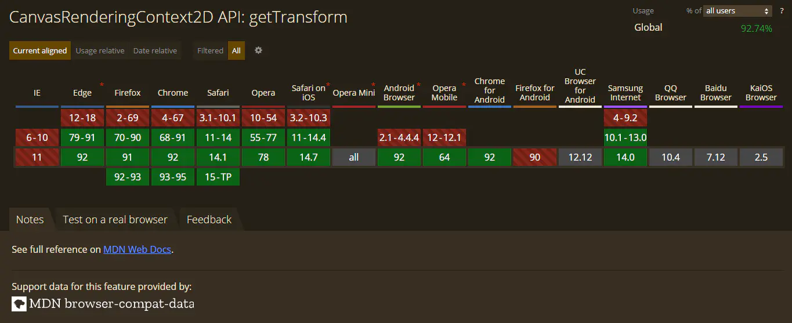
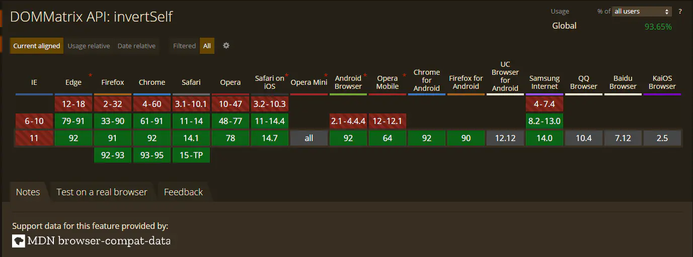

最近在制作公司的一个项目时有运用到[canvas](https://developer.mozilla.org/zh-CN/docs/Web/API/Canvas_API)与屏幕坐标互相转换的一个知识点，如果没有进行[canvas](https://developer.mozilla.org/zh-CN/docs/Web/API/Canvas_API)[缩放](https://developer.mozilla.org/zh-CN/docs/Web/API/CanvasRenderingContext2D/scale)、[旋转](https://developer.mozilla.org/zh-CN/docs/Web/API/CanvasRenderingContext2D/rotate)、[平移](https://developer.mozilla.org/zh-CN/docs/Web/API/CanvasRenderingContext2D/translate)一系列操作时，这个需求还是比较简单的，但是如果操作复杂起来后，要再进行转换，在不知道一些特定api就显得比较困难了，在查阅了了一些资料后解决了这个需求这里分享给大家。


## 解决思路
解决这个需求时引用了两个API，分别是[CanvasRenderingContext2D.getTransform()](https://developer.mozilla.org/zh-CN/docs/Web/API/CanvasRenderingContext2D/getTransform)、
[DOMMatrix.invertSelf()](https://developer.mozilla.org/zh-CN/docs/Web/API/DOMMatrix)<br>


[CanvasRenderingContext2D.getTransform()](https://developer.mozilla.org/zh-CN/docs/Web/API/CanvasRenderingContext2D/getTransform)可以获取当前[canvas](https://developer.mozilla.org/zh-CN/docs/Web/API/Canvas_API)上下文的被应用的转换矩阵，返回[DOMMatrix](https://developer.mozilla.org/zh-CN/docs/Web/API/DOMMatrix)对象。<br>
[DOMMatrix.invertSelf()](https://developer.mozilla.org/zh-CN/docs/Web/API/DOMMatrix)可以获取当前矩阵逆转后的结果，注意这个api是会修改自身矩阵的。<br>
我们通过这两个API可以获取当前canvas的[DOMMatrix](https://developer.mozilla.org/zh-CN/docs/Web/API/DOMMatrix)，然后将其逆转，通过逆转后的转换矩阵就可以获取屏幕坐标转对应的canvas坐标了。

## 源码

```js
// 获取canvas的逆转转换矩阵
const getCanvasInverImatrix = $canvas => {
  const ctx = $canvas.getContext('2d')
  const transform = ctx.getTransform()
  return transform.invertSelf();
}

// canvas坐标转屏幕坐标
export const canvasConversionScreen= ($canvas, { x, y }) => {
  const imatrix = getCanvasInverImatrix($canvas)

  // 如果不能求逆is2D()将会为false
  if (imatrix.is2D()) {
    const { 
      a, b, c, 
      d, e, f 
    } = imatrix

    const screenX = (c * y - d * x + d * e - c * f) / (b * c - a * d)
    const screenY = (y - screenX * b - f) / d

    return {
      x: Math.round(screenX),
      y: Math.round(screenY),
    }
  } else {
    return {
      x: NaN,
      y: NaN
    }
  }

}

// 屏幕坐标转canvas坐标
export const screenConversionCanvas = ($canvas, { x, y }) => {
  const imatrix = getCanvasInverImatrix($canvas)

  if (imatrix.is2D()) {
    const { 
      a, b, c, 
      d, e, f 
    } = imatrix

    return {
      x: Math.round(x * a + y * c + e),
      y: Math.round(x * b + y * d + f)
    };
  } else {
    return {
      x: NaN,
      y: NaN
    }
  }
}
```
>注意：[DOMMatrix.invertSelf()](https://developer.mozilla.org/zh-CN/docs/Web/API/DOMMatrix) 是会修改自身矩阵的，所以切忌多次调用，多次调用会逆转后再次逆转。当canvas在网页中不是位于左上角时，传入的屏幕坐标还要进行视口处理，推荐使用[Element.getBoundingClientRect()](https://developer.mozilla.org/zh-CN/docs/Web/API/Element/getBoundingClientRect)API。

## 兼容性

[CanvasRenderingContext2D.getTransform()](https://developer.mozilla.org/zh-CN/docs/Web/API/CanvasRenderingContext2D/getTransform)



[DOMMatrix.invertSelf()](https://developer.mozilla.org/zh-CN/docs/Web/API/DOMMatrix)


可以看到兼容性还是比较良好的，如果没有要求兼容IE就放心大胆的用吧。